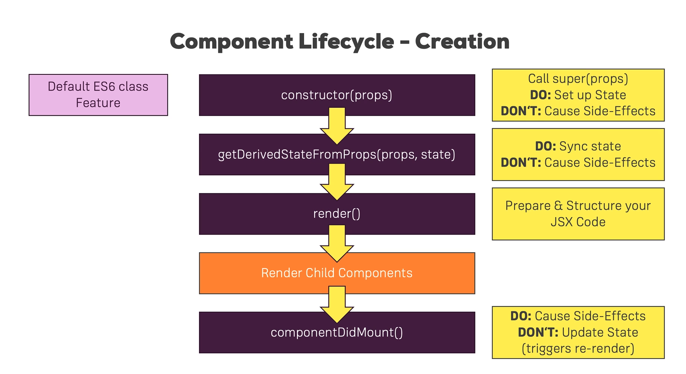
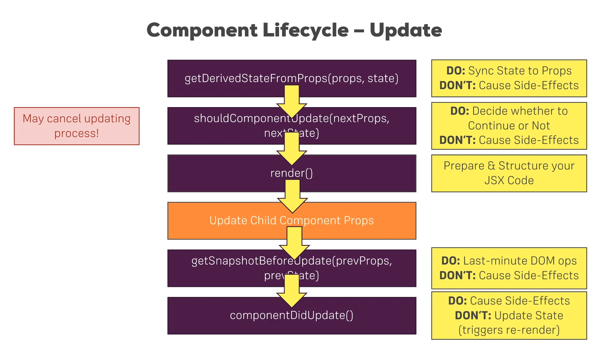
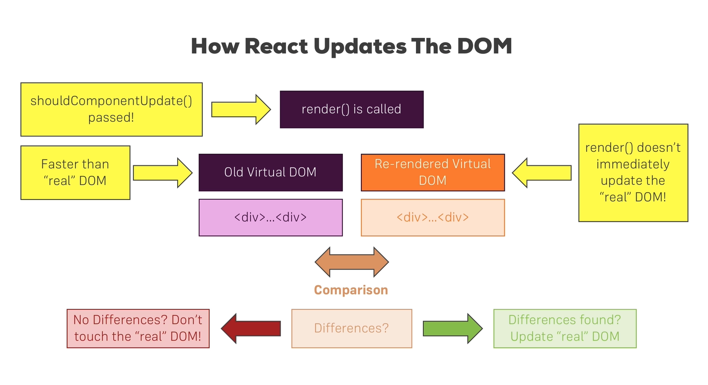

# ReactReview using an application

## Geting started

### Two kinds of applications
- #### single page Applications
   - #### Only one Html page, Content is (re)rendered on Client
  >more popular these days, for it allow you manage the entire page with JavaScript and never have to go back to the server to reload the pages -- better user experience because everything happens instantly; Even if the user needs to wait, you are showing a spinner or you are still presenting a reactive web app
- #### Multi page Applications
   - #### Multiple Html pages, Content is rendered on Server
  >the individual widget does not knows other components' exist. The user always need to wait the server response for it is rendered on server.
  ## ES6 syntax review
### Copy value vs Copy reference
###### For primary data, it always copy value.
```Js
let a = 1
let b = a
a = 5
console.log(a)//a->5
console.log(b)//b->1
```
###### For the Object, it always copy reference. To avoid copy the reference, use a spread operator.
```Js
const person = {
  name: 'Max',
}

const secondPerson = person
person.name = 'Menu'
console.log(secondPerson)//{name: Menu}

const thirdPerson = {...person}
person.name = 'Sara'
console.log(thirdPerson)//{name: Menu}
//it is still named Menu, for using spread will copy the value, not reference.
```
### Arrow Function
###### Arrow function normally could make your code more delicate and concise.
```Js
const printMyName = name => "My name is "+ name
console.log(printMyName("Shura"))
// When you only need to return one line, then you can delete 'return' and the { }
// It also work when you just need a console.log() in your function
// const printMyName = name => console.log("My name is "+ name); printMyname("Shura"); the result is the same
```
###### Some of method that could be used
```Js
const numbers = [1,2,3]
const doubleNumArray = numbers.map(num => {return num*2})
//which equals to
//const doubleNumArray = numbers.map(num => num*2)
console.log(doubleNumArray)
```
## How to start an react app
- downlode the node.js from its websites.
- Mac install npm: `sudo npm install create-react-app -g`, 必须有sudo, 否则会有permission denied.
- create-react-app the <-itsName->
- cd to the address, then `npm start`
## JSX restriction
wrap all element in a single element 
```JSX
class App extends Component {
  render() {
    return (
      <div className="App"> //one <Element></Element> wraped.
      <p> Hi, I'm a react app </p>
      </div>   
    );
  }
}
```
## Components
`import React, {Component} from 'react';`
- For each component, the name needed to be writen using lower case.
- Both the document name and the name that imported in other document need to be capitalized.
```JSX
import React from 'react';
const person = () => {
  return <p>I'm a person!</p>
}
export default person;
``` 
```jsx
import Person from './Person/Person';
```
## dynamic props
### When you need js function in a JSX, using `{}` inside it.
```JSX
import React from 'react';
const person = (props) => {
  return <p>I'm a {props.name} and I am {props.age} years old! {props.children}</p>
}

export default person;
```
## dynamic parameters
```JSX

import React, { Component } from 'react';
import './App.css';
import Person from './Person/Person';
class App extends Component {
  state = {
    persons: [
      { name: 'Max', age: 28},
      { name: 'Manu', age: 29},
      { name: 'Stephanie', age: 26},
    ]
  }
  switchNameHandler = () => {
    console.log("clicked");
  }
  render() {
    const { persons } = this.state;
    return (
      <div className="App">
      <p>Hi, I'm a react app</p>
      <button onClick = {this.switchNameHandler}>Switch Name</button>
      {
        // for(i = 0; i < persons.length; i++){
        //   return <Person name={persons[i].name} age={person[i].age}/>
        // }
        // you cannot write for loop in JSX like above. The effective way to use loop is using map:

        persons.map((value) => {
          return <Person key={value.name} name={value.name} age={value.age}/>
        })
      }     
      </div>   
    );
  }
}

export default App;
```
#### 什么情况可以使用for循环： for loop 在最外层， 即不能使用某个标签里面套for循环再套标签。
### this.setState() and props change are the only two options those could lead react update the DOM.
```JSX
switchNameHandler = () => {
    // function could work e.g. after onClicked
    this.setState(
      {
        persons: [
          { name: 'Max', age: 28},
          { name: 'MM', age: 26},
          { name: 'Stephanie', age: 26},
        ]
      }
    )
  }
```

### Use function components as much as possible, use Class components only when it must have a state.

### The way that children components would like to change the parent components.
```JSX
// First, put the reference of method into the props of chirdren
// second write the call function in the childern components

  render() {
    const { persons } = this.state;
    return (
      <div className="App">
      <p>Hi, I'm a react app</p>
      <button onClick = {() => this.switchNameHandler('Amy', 27)}>Switch Name</button>
      {
        // for(i = 0; i < persons.length; i++){
        //   return <Person name={persons[i].name} age={person[i].age}/>
        // }
        // you cannot write for loop in JSX like above. The effective way to use loop is using map:

        persons.map((value) => {
          return <Person 
                  key={value.name} 
                  name={value.name} 
                  age={value.age}
                  click = {this.switchNameHandler.bind(this,'Sara', 25)}
                  />
        })
      }     
      </div>   
    );
```
### Two ways that parameters could be passed.
- ##### call back function
```JSX
<button onClick = {() => this.switchNameHandler('Amy', 27)}>Switch Name</button>
```
- ##### function.bind(this, parameter1, parameter2,...)
```JSX
persons.map((value) => {
  return <Person 
          key={value.name} 
          name={value.name} 
          age={value.age}
          click = {this.switchNameHandler.bind(this,'Sara', 25)}
          />
})
```
### Responsable Layout
#### When using in .css files
```css
@media(min-width: 500px){
  .Person{
    width: 450px;
  }
}
```
#### using in .js files

```jsx
//using in components
const person = (props) => {
  const styles = {
    '@media(min-width: 500px)': {
      width: '450px'
    }
  };
  return (
    <div className = 'Person' style={styles}>
      <p onClick = {props.click}>I'm a {props.name} and I am {props.age} years old! {props.children}
      </p>
      <input type="text" onChange = {props.changed} value = {props.name}/>
    </div>
  ); 
}

export default Radium(person);

//using these components above by wraping <StyleRoot></StyleRoot> in App.js

import Radium, { Styleroot } from 'radium';
//...
    return (
      <StyleRoot>
      <div className="App">
      <p>Hi, I'm a react app</p>
      <button style={style} onClick = {this.togglePersonsHandler}>Switch Name</button> 
       { 
        // this.state.showPersons == true?   
        showPersons
        // : null         
       }  
      </div> 
      </StyleRoot>  
    );

```

### How to add a Sass Stylesheet -- A simple way to avoid naming problem
[Adding a Sass Stylesheet · Create React App](https://facebook.github.io/create-react-app/docs/adding-a-sass-stylesheet)
### Error Control
#### You can use another component to handle this, then import it to App return stage as a higher rank component. But only do this when you know there is a step could cause errors those cannot avoid. Otherwise it will catch all the errors in the develop process.

```JSX
  import React, {Component} from 'react';

class ErrorBoundary extends Component {
  state = {
    hasError: false,
    errorMessage: ''
  }

  componentDidCatch = (error, info) => {
    this.setState({hasError: true, errorMessage: error});
  }
  
  render(){
    if (this.state.hasError){
      return <h1>{this.state.errorMessage}</h1>
    }else{
      return this.props.children;
    }
  }
}

export default ErrorBoundary;

//App.js
import ErrorBoundary from './ErrorBoundary/ErrorBoundary';
//...

    return (
      <ErrorBoundary>
      <div className={styles.App}>
      <p>Hi, I'm a react app</p>
      <button className={btnClass} onClick = {this.togglePersonsHandler}>Switch Name</button> 
       { 
        // this.state.showPersons == true?   
        showPersons
        // : null         
       }  
      </div> 
      </ErrorBoundary>
    );
```
### Class-based vs Functional Components

| class-based | Functional |
|-------------|------------|
|class XY extends Component| const XY = props =>{...}|
|Access to State| Access to State(useState())|
|lifecycle Hooks| / |
|Access State and Props through "this" | Access Props through "props" |
|this.state.XY & this.props.XY| props.XY |
| Use if you need to manage State or access to Lifecycle Hooks and you don't want to use React Hooks!| Use in all other Case |

### Component Lifecycle - Creation

##### What is Side-Effects: In the end it means like sending a http request or storing something in your local storage of the browser or sending some analytics to Google analytics. The reason that calling it side-effect is it would impact performance and cause unnecessary re-render cycles which of course are pretty bad and you want to avoid.




### Lifecycle Update


```jsx
componentWillUnmount(){
    console.log('Persons.js will unmount')
    //The lifecycle that you use to effect something before the component unmount.
  }
shouldComponentUpdate(nextProps, nextState){
  console.log('[Persons.js] shouldComponentUpdate')
  if(nextProps.persons !== this.props.persons){
    return true
  } else {
    return false
  }
  //this component must return a boolean value, if you like to update the component , return true; else return false.
}
```
### Function Components Hooks 
#### useEffect() : 
- Must use an inside function
- It could be considered as the combination of componentDidMount and componetDidUpdate when there is no second parameters `[...]` behind the () => {}
- Inside of this `[]` means that the condition when this effect need to be triggered. If you leave an empty `[]`, it will be triggerd when it initialized, but it won't reload later.  

```JSX
  useEffect(() => {
    // must inside a function
    console.log('[Cockpit.js] useEfect')
    // faked http request...
    setTimeout(() => {
      alert('Saved data to cloud!')
    }, 1000)
  }, [props.persons]);
```
- return in useEffect(): run this when the the function has loaded in the last time
```jsx
  useEffect(() => {
    // must inside a function
    console.log('[Cockpit.js] useEfect')
    // faked http request...
    setTimeout(() => {
      alert('Saved data to cloud!')
    }, 1000)
    return () => {
      console.log('[Cockpit.js] cleanup work in useEffect')
    }
  }, []);

```
- If you leave the second parameter after the call back function empty, then it would load the content in the return every time , cause react does not know which time is the last one.
```jsx
  useEffect(() => {
    console.log('[Cockpit.js] 2nd useEffect')
    return () => {
      console.log('[Cockpit.js] cleanup work in 2nd useEffect')
    }
  })
```
### How to pervent the unnecessary re-render of function based components -- use React.memo()
#### It matches the shouldComponentUpdate(nextProps, nextState) in Class based components.
```jsx
export default React.memeo(Cockpit);
```
#### Attention points: If your components should be updated after the parents components updated, then you do not need to add shouldComponentUpdate or React.memo(), otherwise you are just waste the loading time.

#### And if you think to manage the shouldComponentUpdate and write these updating conditiions yourselves are too complicated...
```
class Persons extends PureComponent {
....
}
```
#### It will manage the shouldComponentUpdate for you automaticly

## How React Updates The DOM


### Rendering Adjacent JSX Elements

##### React does not allow to have two or more element, but it allows to return array, and it need to be initialized a unique key.
```jsx
render(){
    console.log('[Persons.js] rendering...');   
    return this.props.persons.map((val,index) => {   
      return (
        <Person 
        key = {val.id}
        name = {val.name} 
        age = {val.age}
        click = {() => {this.props.clicked(index)}}
        changed = {(e) => {this.props.changed(e, val.id)}}
        /> 
      )    
    })
  }
```
### Higher Order Components(HOC) - Introduction

```jsx
import React from 'react';

const WithClass = props => {
  return <div className = {props.classes}> {props.children} </div>
}
export default WithClass;

```
```jsx
return (
  <WithClass classes={styles.App}>
  <button 
    onClick = {() => {
      this.setState({showCockpit: false})
    }}
  >
    Remove Cockpit
  </button>
    {
      this.state.showCockpit == true ?
        <Cockpit 
        title = {this.props.appTitle}
        showPersons = {this.state.showPersons}
        // persons = {this.state.persons}
        clicked = {this.togglePersonsHandler}
        /> : null
    }
    { 
      // this.state.showPersons == true?   
      showPersons
      // : null         
    }  
  </WithClass> 
);
```
## Example to use the HOC
```jsx
// In withClass.js
import React from 'react';
// This withClass component is a high order component.
const withClass = (WrappedComponent, className) => {
  return props => (
   <div className = {className}> 
    <WrappedComponent {...props}/>
   </div>
  ) 
}
export default withClass;
```
```jsx
// In App.js
export default withClass(App, styles.App);
```
#### Attention points

- 如果你想用高阶组件的话，传入的component中的props一定要记得解构，不然全都拿不到。。。
- 凡是return function的情况 return的function里面也要记得return

### When updating a state depends on its previous state
#### A bad way has given below...
```jsx
this.setState({
    persons: persons,
    changeCounter: this.state.changeCounter + 1,
    //It might still work when the only component calling this, but it actually cannot garantee the sequence, it would cause error when the situation become more complicate.
})
```
#### A good way to solve this
```jsx
// A good way to solve this
this.setState((prevState, props) => {
  return {
    persons: persons,
    changeCounter: prevState.changeCounter + 1,
  }
})
```
### PropTypes
#### Follow these steps:
- Terminal: `npm install --save prop-types`
- Import proptype in the file: `import PropTypes from  'prop-types';`
##### Just show it with an example
```jsx
import React, { Component } from 'react';
// import Radium from 'radium';
import PropTypes from 'prop-types';
import styleModule from './Person.module.scss';
import withClass from '../../../hoc/withClass';
class Person extends Component {
  render(){ 
    return (
      <div>
        <p onClick = {this.props.click}>
          I'm a {this.props.name} and I am {this.props.age} years old! {this.props.children}
        </p>
        <input type="text" onChange = {this.props.changed} value = {this.props.name}/>
      </div>
    ); 
  }
}

Person.propTypes = {
  click: PropTypes.func,
  name: PropTypes.string,
  age: PropTypes.number,
  changed: PropTypes.func,
}

export default withClass(Person, styleModule.Person);
```
### ref

#### Two ways to use ref
- #### Method 1: using a callback fuction inside ref, then call this in componentDidMount() lifeCyle
```jsx
class Person extends Component {

  componentDidMount() {
     this.inputElement.focus();
  }
  render(){
    return (
      <div>
        <p onClick = {this.props.click}>
          I'm a {this.props.name} and I am {this.props.age} years old! {this.props.children}
        </p>
        <input 
        type="text" 
        ref = {(inputEl) => {this.inputElement = inputEl}}
        onChange = {this.props.changed} 
        value = {this.props.name}/>
      </div>
    ); 
  }
}
```
- #### Method 2: using the `React.createRef()` to get the ref, then call it in the componentDidMount(), *Pay attention when using constructor, always bring `super()` inside*.
```jsx
class Person extends Component {
  constructor(props){
    super(props)
    this.inputElementRef = React.createRef()
  }
  componentDidMount() {
    this.inputElementRef.current.focus();
  }
  render(){
    return (
      <div>
        <p onClick = {this.props.click}>
          I'm a {this.props.name} and I am {this.props.age} years old! {this.props.children}
        </p>
        <input 
        type="text" 
        //ref = {(inputEl) => {this.inputElement = inputEl}}
         ref = {this.inputElementRef}
        onChange = {this.props.changed} 
        value = {this.props.name}/>
      </div>
    ); 
  }
}
```
### Ref in function components
#### React.createRef() will not work in the function components, import `useRef` in the file then initialize  it at the beginning, then call it in hooks (It is because hooks would apply after the JSX loaded, otherwise it will cause error, for the document cannot find the ref at the beginning)
```jsx
import React, { useEffect, useRef } from 'react';
import styles from'./Cockpit.module.scss';
const Cockpit = (props) => {
  const toggleBtnRef = useRef(null);
  //toggleBtnRef.current.click(); cannot written here for the document would load the JSX at the end, so it cannot find where is the ref of toggleBthRef 
  useEffect(() => {
    // must inside a function
    console.log('[Cockpit.js] useEfect') 
    toggleBtnRef.current.click();
    return () => {
      console.log('[Cockpit.js] cleanup work in useEffect')
    }
  }, []);

  useEffect(() => {
    console.log('[Cockpit.js] 2nd useEffect')
    return () => {
      console.log('[Cockpit.js] cleanup work in 2nd useEffect')
    }
  })
  
  let btnClass = styles.button;
  if(props.showPersons){
    btnClass = styles.buttonClicked;
  }
  return (
    <div>
      <p>{props.title}</p>
      <button ref = {toggleBtnRef} className={btnClass} onClick = {props.clicked}>Switch Name</button> 
    </div>
  );
}
export default React.memo(Cockpit); 
```
### How to solve the props chains problem -- Using the Context API
#### This is a good way to solve the problem that A -> B -> C -> D, only D need the info of A, without this context API all the components should transmit the info into themselves.
```jsx
// auth-context.js, also the context API
import React from 'react';

const authContext = React.createContext({
  authenticated: false,
  login: () => {},
});
// Inside the React.createContext() is an object.
// The values inside are all default

export default authContext;
```
#### All the place that need the to receive the context must be wrapped in <[this API].Provider>
```jsx
  <AuthContext.Provider 
  value = {{
    authenticated: this.state.authenticated, 
    login: this.loginHandler}}>
    /*This is the initialize place*/
  {
    this.state.showCockpit === true ?
      <Cockpit 
        title = {this.props.appTitle}
        showPersons = {this.state.showPersons}
        // persons = {this.state.persons}
        clicked = {this.togglePersonsHandler}
        login = {this.loginHandler}
      /> : null
  }
  { showPersons }
  </AuthContext.Provider>
```
#### Then each part that needs the info pickup their needs in <[this API].Consumer>
```jsx
// Cockpit.js
  return (
    <div>
      <p>{props.title}</p>
      <button ref = {toggleBtnRef} className={btnClass} onClick = {props.clicked}>Switch Name</button>
      <AuthContext.Consumer>
        {(context) => <button onClick = {context.login}>log in</button>}
      </AuthContext.Consumer>
    </div>
  );
```
#### Attention points
- always using a call-back function to get the info
- when using API, there is no props.value, always `context.value`
```jsx
// Person.js (without any redundancy caused in Persons.js)
  return (
      <div>
        <AuthContext.Consumer>
        {context =>
          context.authenticated ? <p>Authenticated!</p> : <p>Please log in</p>
        }
        </AuthContext.Consumer>
        <p onClick = {this.props.click}>
          I'm a {this.props.name} and I am {this.props.age} years old! {this.props.children}
        </p>
        <input 
        type="text" 
        // ref = {(inputEl) => {this.inputElement = inputEl}}
        ref = {this.inputElementRef}
        onChange = {this.props.changed} 
        value = {this.props.name}/>
      </div>
  ); 
```
### How to use context API with a decent way
#### It is too long to write <AuthContext.Consumer></AuthContext.Consumer> in all the components those who need the context info, here is a more decent way to avoid this.
- #### in class-based components:
```jsx
class Person extends Component {
  constructor(props){
    super(props)
    this.inputElementRef = React.createRef()
  }
  static contextType = AuthContext;

  componentDidMount() {
    // this.inputElement.focus();
    this.inputElementRef.current.focus();
    console.log(this.context.authenticated);
  }
  render(){
    return (
        <div>      
          {
            this.context.authenticated ? <p>Authenticated!</p> : <p>Please log in</p>
          }      
          <p onClick = {this.props.click}>
            I'm a {this.props.name} and I am {this.props.age} years old! {this.props.children}
          </p>
          <input 
          type="text" 
          // ref = {(inputEl) => {this.inputElement = inputEl}}
          ref = {this.inputElementRef}
          onChange = {this.props.changed} 
          value = {this.props.name}/>
        </div>
    ); 
  }
}
```
#### Attention points:
- ##### initialize the static contextType to add context as an attribution in this object: `static contextType = AuthContext;`
- ##### Then using it with the form this.context.[your keyname] in JSX area: `{this.context.authenticated ?<p>Authenticated!</p>:<p>Please log in</p>}`

- #### function-based component
##### function-based component cannot create 'this', so it need another way to solve this. This method is only available after React 16.6
```jsx
import React, { useEffect, useRef, useContext } from 'react';
import styles from'./Cockpit.module.scss';
import AuthContext from '../../context/auth-context';
const Cockpit = (props) => {
  const toggleBtnRef = useRef(null);
  const authContext = useContext(AuthContext);

  console.log(authContext.authenticated);
  useEffect(() => {
    // must inside a function
    console.log('[Cockpit.js] useEfect')
    // // faked http request...
    // setTimeout(() => {
    //   alert('Saved data to cloud!')
    // }, 1000)
    toggleBtnRef.current.click();
    return () => {
      console.log('[Cockpit.js] cleanup work in useEffect')
    }
  }, []);

  useEffect(() => {
    console.log('[Cockpit.js] 2nd useEffect')
    return () => {
      console.log('[Cockpit.js] cleanup work in 2nd useEffect')
    }
  })
  
  let btnClass = styles.button;
  if(props.showPersons){
    btnClass = styles.buttonClicked;
  }
  return (
    <div>
      <p>{props.title}</p>
      <button ref = {toggleBtnRef} className={btnClass} onClick = {props.clicked}>Switch Name</button>
      <button onClick = {authContext.login}>log in</button>
    </div>
  );
}
export default React.memo(Cockpit); 
```
#### Attention points
- ##### import useContext `import React, { useEffect, useRef, useContext } from 'react';`
- ##### create a parameter to access the context uing useContext(): `const authContext = useContext(AuthContext);`
- ##### Then you can receive the context info by calling [your parameter].key: `<button  onClick  =  {authContext.login}>log in</button>`